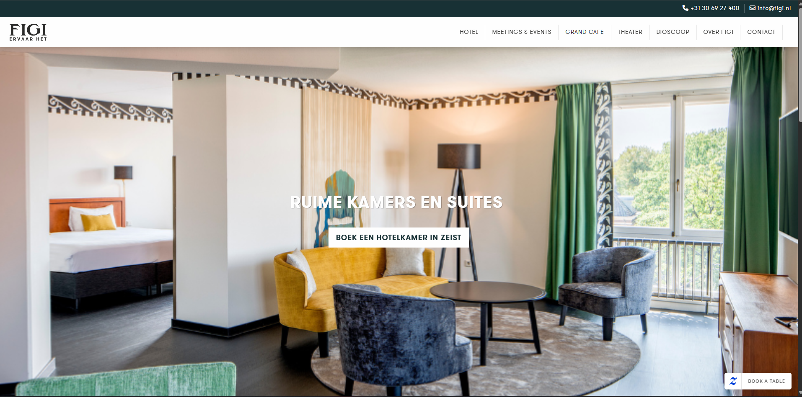
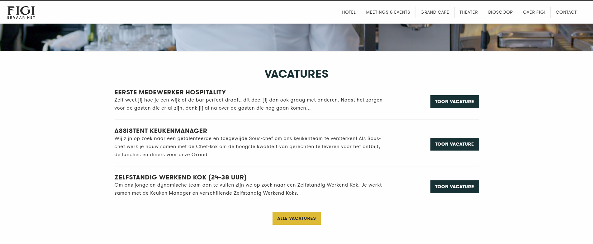
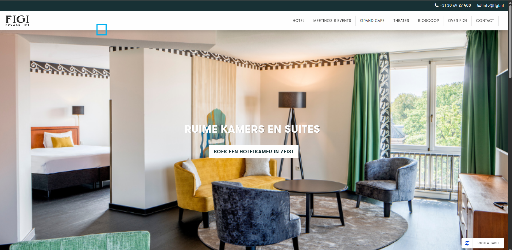
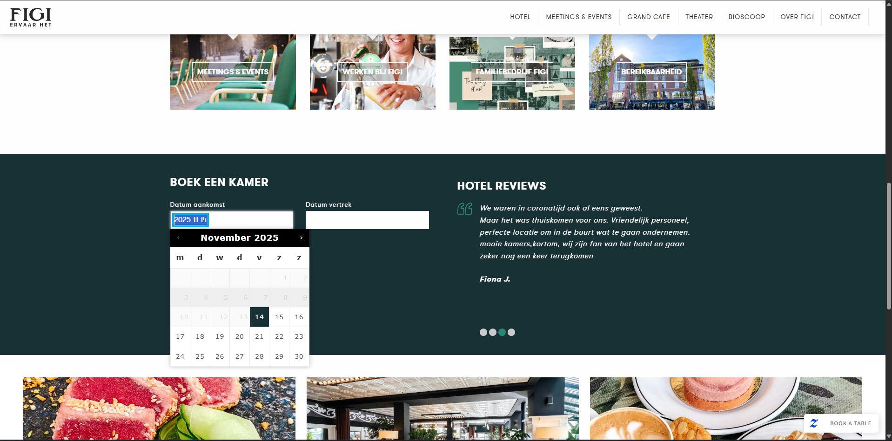

# Procesverslag
Markdown is een simpele manier om HTML te schrijven.  
Markdown cheat cheet: [Hulp bij het schrijven van Markdown](https://github.com/adam-p/markdown-here/wiki/Markdown-Cheatsheet).

Nb. De standaardstructuur en de spartaanse opmaak van de README.md zijn helemaal prima. Het gaat om de inhoud van je procesverslag. Besteedt de tijd voor pracht en praal aan je website.

Nb. Door *open* toe te voegen aan een *details* element kun je deze standaard open zetten. Fijn om dat steeds voor de relevante stuk(ken) te doen.

## Jij

  
uitwerken voor kick-off werkgroep

  ### Auteur:
  Senuk Wickramasinghe

  #### Je startniveau:
  Blauw

  #### Je focus:
  Surface plane
 

## Je website

  
uitwerken voor kick-off werkgroep

  ### Je opdracht:
  [https://www.vanschaikzeist.nl/](https://www.figi.nl/)

  #### Screenshot(s) van de eerste pagina (small screen): 
  #### Van Schaik Zeist -Home
  ##### Welkom pagina van Figt, Theater Zeist
  

  #### Screenshot(s) van de tweede pagina (small screen):
  #### Van Schaik Zeist - Projecten
  ##### Over Ons Pagina
  

 

## Toegankelijkheidstest 1/2 (week 1)

  
uitwerken na test in 2e werkgroep

  
  ### Screenreader
  
  Nadat ik de toegankelijkheid op mijn apparaat had ingeschakeld, heb ik de website bezocht om te controleren hoe goed de schermlezer daarop presteerde. De bovenkant van de website deed het goed, maar toen ik verder naar beneden scrolde, begonnen er fouten te verschijnen.
  Met Tab probeerde ik verder te navigeren, maar ik merkte dat de screenreader verborgen elementen oppikte.  
  Met Capslock + F7 kon ik alle links bekijken, en op dezelfde manier zag ik ook de headings. De docent stelde voor een extensie te installeren om de heading-structuur beter te kunnen zien.

  #### Bevindingen (Screenreader)
  

**Verborgen items:** De screenreader detecteerde elementen die visueel niet zichtbaar zijn.

**Datumselectie niet leesbaar:** De schermlezer kon het tabblad “Datum selecteren” niet detecteren.

  ---

  ### WCAG Checklist

  #### Bevindingen (WCAG)

  **Global Code**
-Validate HTML: via https://validator.w3.org/nu/ kwamen veel fouten naar voren.
-Unique title: de welkomstpagina heeft geen paginatitel.

  **Keyboard**
-Navigeren met toetsenbord: sommige elementen konden niet geselecteerd worden.

  **Mobile & Touch**
-Size & position: bepaalde items worden te klein weergegeven in de mobiele weergave.
-Spacing: sommige items staan te dicht op elkaar.

  **Headings**
-Meerdere H1-elementen op dezelfde pagina.
-Onlogische structuur: een H1 staat onder een H2.

  **Lists**
-Geen correcte lijststructuur: veel divs in divs gebruikt.

  **Images**
-Geen alt-attributen aanwezig op sommige afbeeldingen.

  **Appearance**
-Geen dark mode beschikbaar.
  

## Breakdownschets (week 1)

  
uitwerken na afloop 3e werkgroep

  ### de hele pagina: 
  

  ### dynamisch deel (bijv menu): 
  

  ### wellicht nog een dynamisch deel (bijv filter): 
  

## Voortgang 1 (week 2)

  
uitwerken voor 1e voortgang

  ### Stand van zaken
  hier dit ging goed & dit was lastig (neem ook screenshots op van delen van je website en code)

  ### Agenda voor meeting
  samen met je groepje opstellen

  | student 1      | student 2          | student 3    | student 4        |
  | ---            | ---                | ---          | ---              |
  | dit bespreken  | en dit             | en ik dit    | en dan ik dat    |
  | en dat ook nog | dit als er tijd is | nog een punt | dit wil ik zeker |
  | ...            | ...                | ...          | ...              |

  ### Verslag van meeting
  hier na afloop snel de uitkomsten van de meeting vastleggen

  - punt 1
  - punt 2
  - nog een punt
  - ...

## Voortgang 2 (week 3)

  
uitwerken voor 2e voortgang

  ### Stand van zaken
  hier dit ging goed & dit was lastig (neem ook screenshots op van delen van je website en code)

  ### Agenda voor meeting
  samen met je groepje opstellen

  | student 1      | student 2          | student 3    | student 4        |
  | ---            | ---                | ---          | ---              |
  | dit bespreken  | en dit             | en ik dit    | en dan ik dat    |
  | en dat ook nog | dit als er tijd is | nog een punt | dit wil ik zeker |
  | ...            | ...                | ...          | ...              |

  ### Verslag van meeting
  hier na afloop snel de uitkomsten van de meeting vastleggen

  - punt 1
  - punt 2
  - nog een punt
- ...

## Toegankelijkheidstest 2/2 (week 4)

  
uitwerken na test in 9e werkgroep

  ### Bevindingen
  Lijst met je bevindingen die in de test naar voren kwamen (geef ook aan wat er verbeterd is):

## Voortgang 3 (week 4)

  
uitwerken voor 3e voortgang

  ### Stand van zaken
  hier dit ging goed & dit was lastig (neem ook screenshots op van delen van je website en code)

  ### Agenda voor meeting
  samen met je groepje opstellen

  | student 1      | student 2          | student 3    | student 4        |
  | ---            | ---                | ---          | ---              |
  | dit bespreken  | en dit             | en ik dit    | en dan ik dat    |
  | en dat ook nog | dit als er tijd is | nog een punt | dit wil ik zeker |
  | ...            | ...                | ...          | ...              |

  ### Verslag van meeting
  hier na afloop snel de uitkomsten van de meeting vastleggen

  - punt 1
  - punt 2
  - nog een punt
  - ...

## Eindgesprek (week 5)

  
uitwerken voor eindgesprek

  ### Je uitkomst - karakteristiek screenshots:
  

  ### Dit ging goed/Heb ik geleerd: 
  Korte omschrijving met plaatjes

  

  ### Dit was lastig/Is niet gelukt:
  Korte omschrijving met plaatjes

  

## Bronnenlijst

  
continu bijhouden terwijl je werkt

  Nb. Wees specifiek ('css-tricks' als bron is bijv. niet specifiek genoeg). 
  Nb. ChatGpT en andere AI horen er ook bij.
  Nb. Vermeld de bronnen ook in je code.

  1. bron 1
  2. bron 2
  3. ...

