# Procesverslag
Markdown is een simpele manier om HTML te schrijven.  
Markdown cheat cheet: [Hulp bij het schrijven van Markdown](https://github.com/adam-p/markdown-here/wiki/Markdown-Cheatsheet).

Nb. De standaardstructuur en de spartaanse opmAaak van de README.md zijn helemaal prima. Het gaat om de inhoud van je procesverslag. Besteedt de tijd voor pracht en praal aan je website.

Nb. Door *open* toe te voegen aan een *details* element kun je deze standaard open zetten. Fijn om dat steeds voor de relevante stuk(ken) te doen.

## Jij

  
uitwerken voor kick-off werkgroep

  ### Auteur:
  Senuk Wickramasinghe

  #### Je startniveau:
  Blauw

  #### Je focus:
  Surface plane
 

## Je website

  
uitwerken voor kick-off werkgroep

  ### Je opdracht:
  [https://www.vanschaikzeist.nl/](https://www.figi.nl/)

  #### Screenshot(s) van de eerste pagina (small screen): 
  #### Figi Zeist - Home
  ##### Welkom pagina van Figi, Theater Zeist
  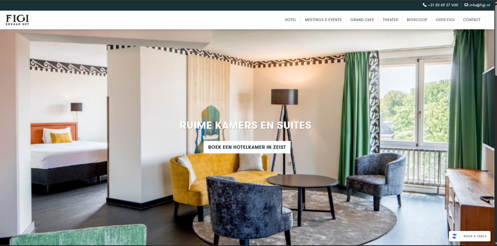

  #### Screenshot(s) van de tweede pagina (small screen):
  #### Figi Zeist - Over Ons 
  ##### Over Ons Pagina
  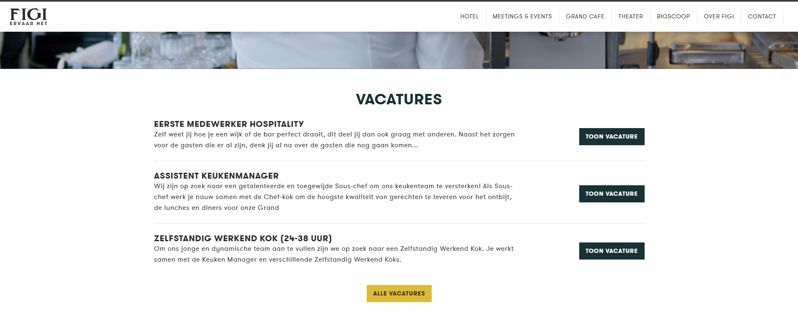

 

## Toegankelijkheidstest 1/2 (week 1)

  
uitwerken na test in 2e werkgroep

  
  ### Screenreader
  
  Nadat ik de toegankelijkheid op mijn apparaat had ingeschakeld, heb ik de website bezocht om te controleren hoe goed de schermlezer daarop presteerde. De bovenkant van de website deed het goed, maar toen ik verder naar beneden scrolde, begonnen er fouten te verschijnen.
  Met Tab probeerde ik verder te navigeren, maar ik merkte dat de screenreader verborgen elementen oppikte.  
  Met Capslock + F7 kon ik alle links bekijken, en op dezelfde manier zag ik ook de headings. De docent stelde voor een extensie te installeren om de heading-structuur beter te kunnen zien.

  #### Bevindingen (Screenreader)
  
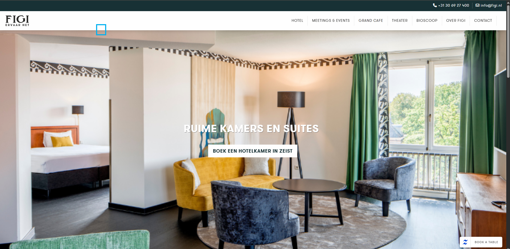

**Verborgen items:** De screenreader detecteerde elementen die visueel niet zichtbaar zijn.

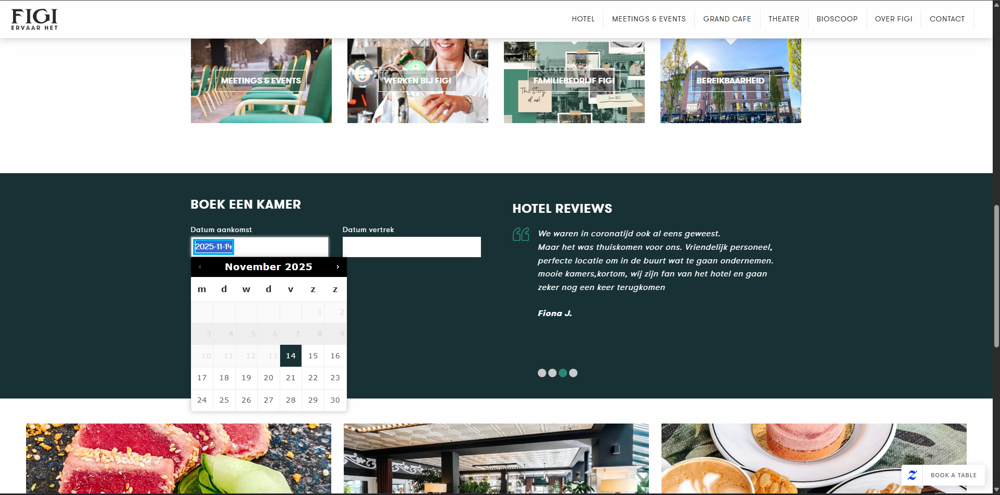

**Datumselectie niet leesbaar:** De schermlezer kon het tabblad “Datum selecteren” niet detecteren.

  ---

  ### WCAG Checklist
  
Ik heb met Ronald samengewerkt om de checklist te maken. De uitgeprinte checklist gaf geen goede uitleg. We besloten om in plaats daarvan de website te gebruiken. Wat me opviel, is dat de checklist geen rekening houdt met animatie en overgangen. De checklist hielp wel om te zien dat er veel fouten op de website stonden die verbeterd moesten worden.

  #### Bevindingen (WCAG)

**Global Code**
- Validate HTML: via https://validator.w3.org/nu/ kwamen veel fouten naar voren.

- Unique title: de welkomstpagina heeft geen paginatitel.

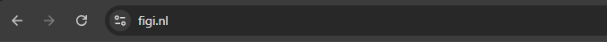

**Keyboard**
- Navigeren met toetsenbord: sommige elementen konden niet geselecteerd worden.

**Mobile & Touch**
- Size & position: bepaalde items worden te klein weergegeven in de mobiele weergave.

  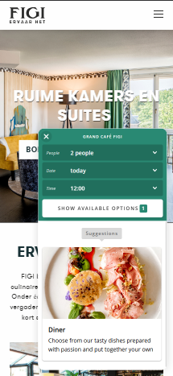
  
- Spacing: sommige items staan te dicht op elkaar.

**Headings**
- Meerdere H1-elementen op dezelfde pagina.
- Onlogische structuur: een H1 staat onder een H2.

**Lists**
- Geen correcte lijststructuur: veel divs in divs gebruikt.

**Images**
- Geen alt-attributen aanwezig op sommige afbeeldingen.

**Appearance**
- Geen dark mode beschikbaar.

  

## Breakdownschets (week 1)

  
uitwerken na afloop 3e werkgroep

  ### de hele pagina: 
  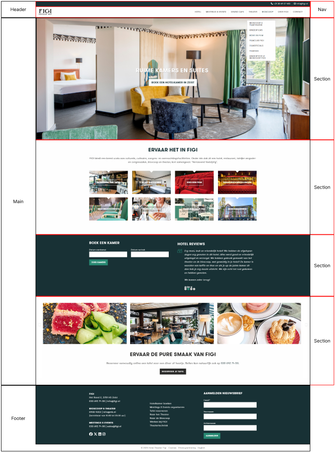
  **Hele pagina**
  - Ik begon met het opdelen van alles in onderdelen uit de HTML-boilerplate-sjabloon. Ik voegde ook toe wat elke sectie is.

  ### dynamisch deel (Nav): 
  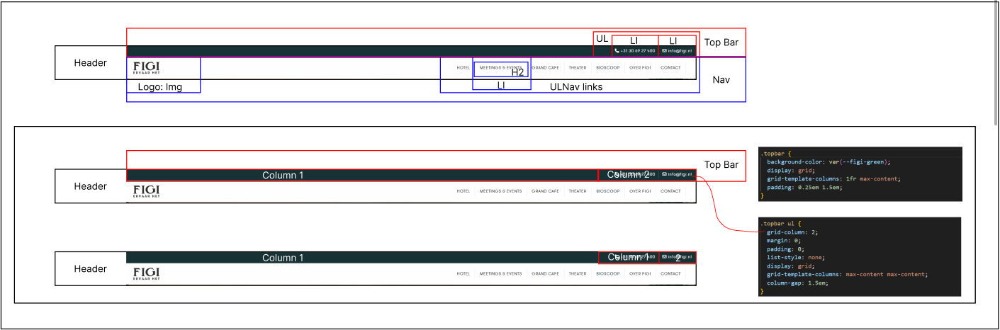
  **Nav**
  - De navigatiebalk is verdeeld in twee secties. Deze secties zijn verdeeld met behulp van een raster. Het bovenste deel van het raster wordt de bovenste balk genoemd en het onderste deel de navigatiebalk. Elk deel heeft ook een raster. Ze kunnen worden verplaatst of      vergroot of verkleind.
  
  ### dynamisch deel (Experience): 
  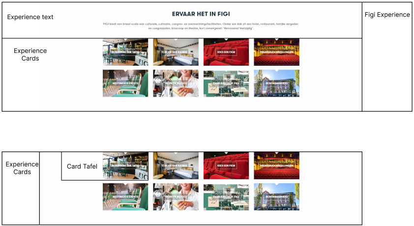
  **Experience**
  - Ik heb de heldensectie ook met behulp van rasters gemaakt. Onder het rastergedeelte bevindt zich een gedeelte voor de verschillende ervaringen die je bij Figi kunt beleven. Ik heb een sectie genaamd Figi Experience aangemaakt en er een raster van gemaakt. Het bovenste gedeelte heet Experience Text en het onderste gedeelte heet Experience Cards. Experience Text heeft een h2 erin, die gecentreerd is. Experience Cards is ook een raster, met secties met kaarten en hun namen erop.

## Voortgang 1 (week 2)

  
uitwerken voor 1e voortgang

  ### Stand van zaken
  hier dit ging goed & dit was lastig (neem ook screenshots op van delen van je website en code)

  ### Agenda voor meeting
  samen met je groepje opstellen

  | student 1: August           | student 2: Kevin            | student 3: Senuk    | student 4        |
  | ---                         | ---                         | ---                 | ---              |
  | Hoe maak je een grafiek,    | Hoe maak je een svg         | Hoe maak je forms   | en dan ik dat    |
  | mag ik ook foto gebruiken?  |  die alleen in de html zit, | en een carousel     | dit wil ik zeker |
  | Grid of flexbox?            |  naar een bestand           | ...                 | ...              |

  ### Verslag van meeting
  hier na afloop snel de uitkomsten van de meeting vastleggen
<input type="date">: Voor forms gebruiken
CSS config: Voor een Carousel: https://chrome.dev/carousel-configurator/
3 css pages - Above the main css, header and footer in it as well.
Every section starts with H2

## Voortgang 2 (week 3)

  
uitwerken voor 2e voortgang

  ### Stand van zaken
  hier dit ging goed & dit was lastig (neem ook screenshots op van delen van je website en code)

  ### Agenda voor meeting
  samen met je groepje opstellen

 
  | August                                 | Senuk              | student 3    | student 4        |
  | ---                                    | ---                | ---          | ---              |
  | Hoe maak ik mijn h2 en a naast elkaar? | Hamburger Menu     | en ik dit    | en dan ik dat    |
  | Is mijn media query voor meter oke?    | Pop-Up voor text   | nog een punt | dit wil ik zeker |
  | Hoe hide ik mijn h3's?                 | ...                | ...          | ...              |
 

  ### Verslag van meeting
  hier na afloop snel de uitkomsten van de meeting vastleggen
Codepen voorbeeld gebruiken voor Hamburger menu
Surface plane toevoegen
H2 en H3 hierachy moet je nog toevoegen

## Toegankelijkheidstest 2/2 (week 4)

  
uitwerken na test in 9e werkgroep

  
  ### Screenreader
  
Ik heb de schermlezer op mijn apparaat aangezet en ik kan erdoorheen bladeren door op Tab en de pijltjestoetsen te drukken. Ik heb geprobeerd Capslock F6 te gebruiken om naar de koppen te springen. Maar mijn laptop geeft aan dat de functie niet werkt.

  #### Bevindingen (Screenreader)
  
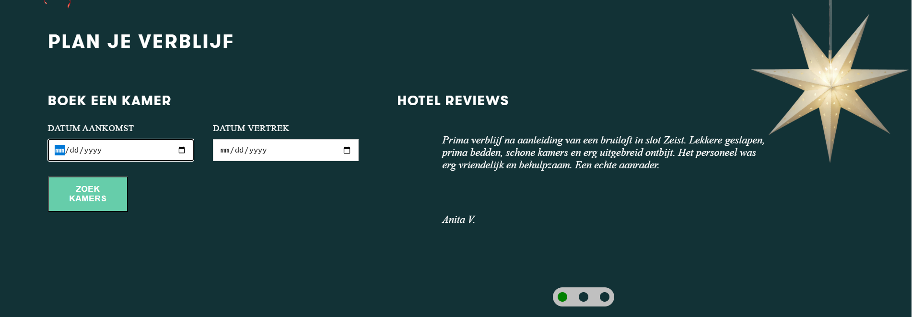

**Verborgen items:** In de vorige test met de schermlezer was er geen optie voor de gebruiker om de datums te zien en iets te selecteren. De schermlezer selecteert de datums nu wel.

  ### WCAG Checklist
  
Deze keer heb ik de test alleen gedaan. Mijn code is nog niet helemaal af en ik moest nog een aantal onderdelen toevoegen om hem responsive te maken.

  #### Bevindingen (WCAG)

**Content**
- Alles staat op zijn plaats, de links zijn beschreven. Ik gebruik eenvoudige taal.
**Global Code**
- Het enige probleem dat ik met dit onderdeel had, is dat wanneer ik mijn HTML valideer, er staat dat ik Aria Label moet gebruiken in plaats van alt-tekst.
- En ik moet divs gebruiken, wat niet klopt.

**Keyboard**
- De datumselector kan nu met het toetsenbord worden bediend.
- Ik moet nog een focusstatus toevoegen.

**Mobile & Touch**
-Er is een probleem met horizontaal scrollen, omdat een deel van de voettekst nog steeds zichtbaar is.

**Headings**
- Alle onderdelen hiervan zijn nu beter. Er is slechts één H1 en er is een hiërarchie voor de koppen.

**Lists**
- Er worden geen divs meer gebruikt in de HTML. Alleen secties en 3 spans. De spans worden gebruikt voor een hamburgermenu.

**Images**
- Bijna alles klopt. Ik heb een alt-tekst aan een kerstversiering toegevoegd. Die moet verwijderd worden.

**Appearance**
-Ik heb een video aan de achtergrond toegevoegd. Deze kan worden gestopt met de optie 'Reduced Motion'.

**Controls**
-Moet nog focus states toevoegen.

**Appearance**
- Heeft een darkmode.
- Contrast van de tekst moet nog nagekeken worden en  de maat van de text moet nog aangepast worden.
  
 **Color contrast**
- Contrast van de tekst moet nog nagekeken worden en  de maat van de text moet nog aangepast worden.

## Voortgang 3 (week 4)

  
uitwerken voor 3e voortgang

  ### Stand van zaken
  hier dit ging goed & dit was lastig (neem ook screenshots op van delen van je website en code)

  ### Agenda voor meeting
  samen met je groepje opstellen

  | Senuk W.A.     | student 2          | student 3    | student 4        |
  | ---            | ---                | ---          | ---              |
  | Hoe kan ik een video toevoegen in Github | en dit             | en ik dit    | en dan ik dat    |
  | Wat kan ik nog meer toevoegen qua Surface Plane                | dit als er tijd is | nog een punt | dit wil ik zeker |
  | ...            | ...                | ...          | ...              |

  ### Verslag van meeting
  hier na afloop snel de uitkomsten van de meeting vastleggen

-Remove get element by ID, replace document.queryselector
-Start with video that has no animation.
-Sections need to start with an Heading
-Images need to be under the links
-Add skip Link
-Add a focus state, you can call all a,images,buttons on top
-Add an active state 

## Eindgesprek (week 5)

  
uitwerken voor eindgesprek

  ### Je uitkomst - karakteristiek screenshots:
  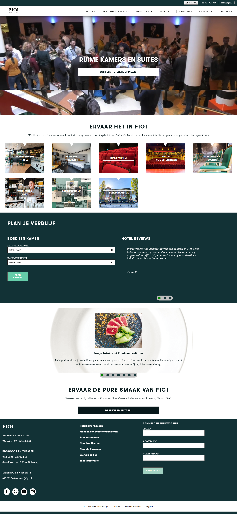
  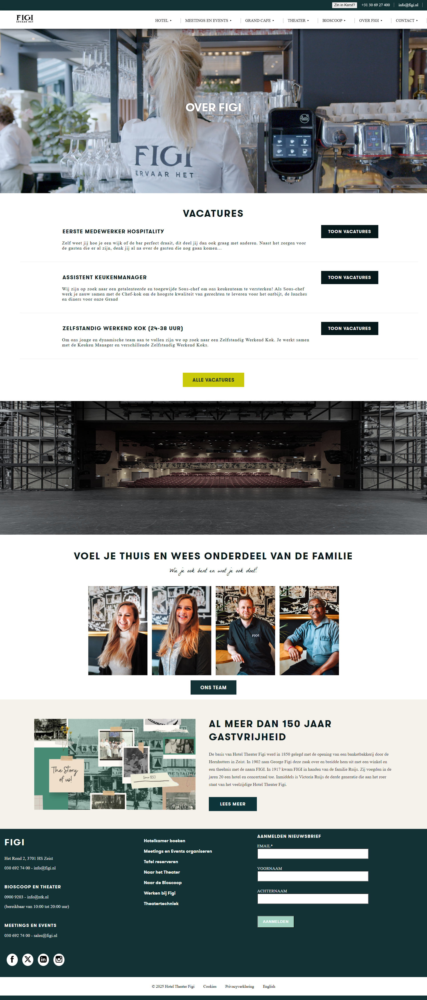
  

  ### Dit ging goed/Heb ik geleerd: 
  Wat heel goed ging, was het begrijpen van hoe JavaScript werkt. In het begin had ik er moeite mee, maar met behulp van CodePen en medestudenten begreep ik het steeds beter.
  Ik heb dit gebruikt om een ​​kerstthema te maken.
  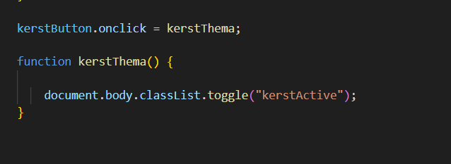
  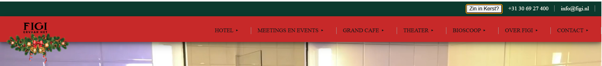

  ### Dit was lastig/Is niet gelukt:
  In het begin had ik moeite met het aanroepen van de U-elementen in plaats van de secties. Omdat ik secties bovenaan had toegevoegd en daaronder een ul, kon ik de secties niet verwijderen in de CSS. Dit kwam      doordat ik de andere sectie in de CSS met nummers had aangeroepen.

  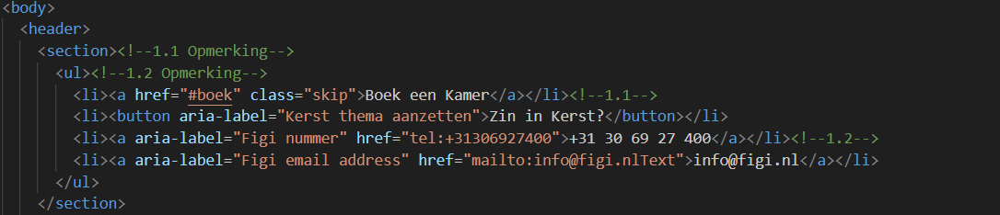

## Bronnenlijst

  
continu bijhouden terwijl je werkt

  
CSS-Styles:
Bronnen-Body
-1.1(Hoe je een Woff2 font moet toevoegen): @font-Face: https://stackoverflow.com/questions/69267704/how-to-import-at-woff2-font-and-use-it-in-a-sass-setting
 Bronnen- Header
-1.1(Hamburger menu maken): Ik heb hulp gekregen van Ronald om dit te maken. Maar ik ging the header verder stylen.
-1.2(Hamburger menu sluit button): Ik moest hiervoor een klasse gebruiken.
 De knop staat buiten de navigatiesectie. Hij wordt ook gepositioneerd door het grids.
  Dit is de makkelijkste manier waarop ik het kon doen. Ik heb dit met de hulp van AI gebruikt om te positioneren van de X icon.
   De voorbeeld dat in de CodePen
  staat houdt darkmode niet in de gaten.
-1.3(Content veranderen): Ik wist niet hoe ik de afbeelding kon veranderen zonder hem te vervangen.
Dus vroeg ik AI hoe ik de inhoud kon vervangen zonder de achtergrond te vervangen.
-1.4(Alternatief voor display:none):Ik heb geprobeerd een manier te vinden om niet elke keer 'display none' te gebruiken. 
Ik zag dat we 'Opacity 0' kunnen gebruiken.https://stackoverflow.com/questions/15855826/css-alternatives-to-style-displaynone

 Bronnen-Header
-1.1(Skip Link)Ik wilde een skiplink toevoegen, ik vond een voorbeeld en een voorbeeldvideo:
https://www.w3schools.com/accessibility/accessibility_skip_links.php
https://www.youtube.com/shorts/a-0HnL33-bY

CSS-Index:
 Main-Hero
-1.1 + 1.1.1 (Video hidden):De docent heeft me geholpen met het toevoegen van de Verborgen optie.
-1.2(Clamp generator voor video ): https://clamp-generator.netlify.app/ Ik heb de klemgenerator 
gebruikt om de video groter te maken naarmate het scherm groter wordt.
Main-Ervaar het in Figi
-1.1 (Image cutouts):De docent heeft me geholpen. 
-1.2 (Filter):https://www.w3schools.com/cssref/css3_pr_filter.php Filter greyscale
Main-Plan je verblijf
-1.1(Animatie): Ik heb de voorbeeldcode uit de les gebruikt voor de animaties.
 De animatie werd maar één keer afgespeeld, dus ik moest AI vragen hoe ik dit oneindig(Infinite) kon maken.
-1.2(Brightness):Ik heb ook gezocht naar hoe ik de helderheid kon inschakelen.
  https://developer.mozilla.org/en-US/docs/Web/CSS/Reference/Values/filter-function/brightness
Main-Boek een kamer button
-1.1 Code van Codepen gebruikt:https://codepen.io/shooft/pen/vENrZvj

CSS-OverFigi:
Al meer dan 150 jaar gastvrijheid 
-1.1(Flex direction)Ik wilde de afbeelding naar links laten komen en ik wilde geen rasters meer gebruiken. 
Ik vroeg AI hoe ik dat het beste kon doen. En hij gaf me deze code.

HTML-Index:
-1.1(Skip Link)Ik wilde een skiplink toevoegen, ik vond een voorbeeld en een voorbeeldvideo:
https://www.w3schools.com/accessibility/accessibility_skip_links.php
https://www.youtube.com/shorts/a-0HnL33-bY
-1.2(Hoe je een aria label moet toevoegen en waar): https://www.quora.com/How-do-you-add-alt-tags-to-links
-1.3(Hulp van Ronald gekregen om de Hamburger menu te maken)
-1.4(Video + Video Hidden): De docent heeft me geholpen met het toevoegen van de Verborgen optie.
 De rest van de code komt uit:https://www.w3schools.com/html/html5_video.asp HTML <video> Autoplay
-1.5(De docent raadde me aan om invoer te gebruiken om de data toe te voegen.
 De student-assistenten vertelden me dat ik labels moest gebruiken. Ik zocht uit hoe ik dat moest doen.)
 https://www.w3schools.com/W3CSS/w3css_input.asp
-1.6(Boek een kamer button): Voorbeeld code van codepen: https://codepen.io/shooft/pen/vENrZvj

Opmerkingen
-1.1(Section maar geen header)Ik heb de leraar hierover gevraagd en hij zei dat het goed was, 
omdat ik de sectie gebruik om er een raster van te maken.
-1.2(Ul oproepen)Dit waren de beginfases van mijn codering. Ik wist niet hoe ik de UL-sectie moest aanroepen,
 maar ik heb de sectie in CSS aangeroepen. In de onderstaande code heb ik de ul-sectie aangeroepen in plaats van de sectie.
-1.3(Geen header na section)Ik heb een afbeelding na de sectie toegevoegd. Het zou een H3 moeten zijn. Maar de afbeelding heeft al een alt-teken,
 zodat de schermlezer het kan lezen. Dit is ook de grid volgorde.

 Javascript:
 -1.1: Ronald heeft me geholpen met de hamburger menu, maar hij had het gedaan met document.getElementById.
-1.2:Hier heb ik wel een class gebruikt.Voorbeeld van Codepen. Dit helpt om de sluit button aan te roepen. 
 Ik heb ook de functie toggle gevonden door AI te vragen.Prompt:How do I turn off the kerst mode when I want to get out of it?
 -1.3: Ik heb de code van codepen gebruikt om een hulp know te maken: https://codepen.io/shooft/pen/vENrZvj

  

